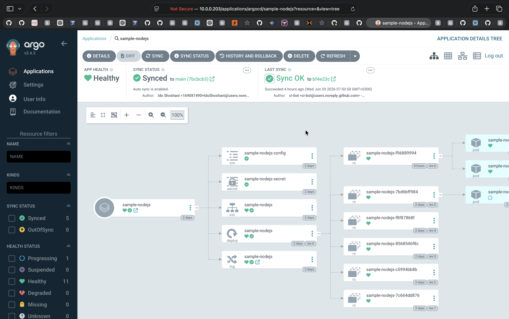
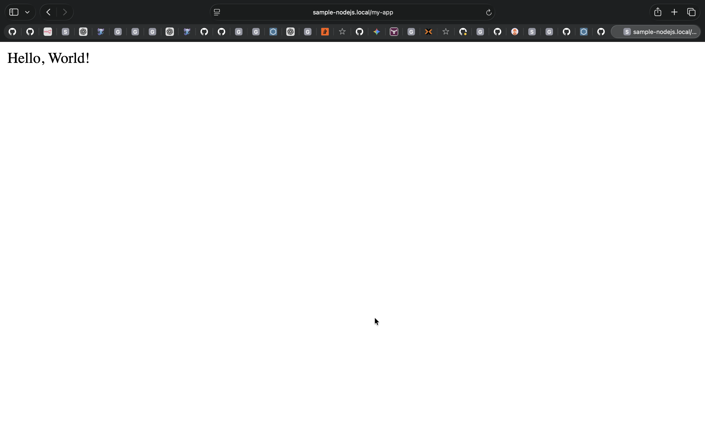
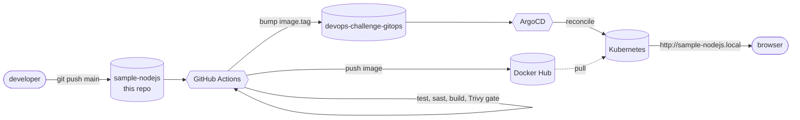

# sample-nodejs

A tiny Node.js + Express service used as the deploy target for a full DevSecOps pipeline. Every push to `main` lints, runs tests, runs SAST (Semgrep), builds a container, blocks on high-severity CVEs (Trivy), publishes to Docker Hub, and commits the new image tag into a separate [GitOps repo](https://github.com/IdoShoshani/devops-challenge-gitops). ArgoCD watches that repo and reconciles the change into a Kubernetes cluster. The app itself is intentionally trivial — the system around it is the point.

## Architecture







## Run it

**Locally (Node):**

```bash
npm ci
npm test           # lint + 4 route tests
npm start          # http://localhost:8080/my-app
```

**In a container (matches what ships):**

```bash
docker build -t sample-nodejs:dev .
docker run --rm -p 8080:8080 sample-nodejs:dev
# curl localhost:8080/{ready,live,my-app,about,metrics}
```

## Pipeline at a glance

| Job       | Runs on         | What it does                                                                  |
| --------- | --------------- | ----------------------------------------------------------------------------- |
| `test`    | every PR + main | `npm ci`, ESLint, `node --test` (4 route tests)                               |
| `sast`    | every PR + main | Semgrep `--config=auto --error --severity=ERROR`                              |
| `release` | main only       | Build · **Trivy block HIGH/CRITICAL** · push to Docker Hub · git tag `v<tag>` |
| `promote` | main only       | `yq` bump `image.tag` in the GitOps repo · commit as `ci-bot`                 |

- **Image tag scheme:** `<package.json#version>-<CI run number>`. Bump `version` in `package.json` for a minor/major release.
- **Failure modes:** SAST or Trivy block the merge before the image is pushed; if `promote` fails, the image exists on Docker Hub but the cluster doesn't move until a re-run.

## Fork & deploy your own

Fork both repos and set three secrets on the app fork:

| Secret               | Value                                                           | Used by   |
| -------------------- | --------------------------------------------------------------- | --------- |
| `DOCKERHUB_USERNAME` | Docker Hub login name                                           | `release` |
| `DOCKERHUB_TOKEN`    | Docker Hub access token (Read/Write)                            | `release` |
| `GITOPS_PAT`         | Fine-grained PAT on the GitOps repo, **Contents: Read & write** | `promote` |

Replace the `idoshoshani123/sample-nodejs` image name in `.github/workflows/ci.yml` with your own. Cluster bring-up (ArgoCD install, repo registration, host mapping) lives in the [GitOps repo README](https://github.com/IdoShoshani/devops-challenge-gitops#readme).

## Extending

**Add a route**

```bash
# 1. add the handler in app.js
# 2. add an assertion in test/app.test.js
git checkout -b feat/<name> && npm test && git commit -am "feat: ..." && git push
gh pr create --fill
```

On merge to `main`, CI builds + pushes the new image; ArgoCD rolls it out (~3 min, or trigger a hard refresh with `kubectl -n argocd annotate application sample-nodejs argocd.argoproj.io/refresh=hard --overwrite`).

**Reproduce the security gates locally**

```bash
docker run --rm -v "$PWD:/src" semgrep/semgrep \
  semgrep scan --config=auto --error --severity=ERROR /src
docker build -t sample-nodejs:ci .
docker run --rm -v /var/run/docker.sock:/var/run/docker.sock aquasec/trivy:latest \
  image --severity HIGH,CRITICAL --ignore-unfixed --exit-code 1 sample-nodejs:ci
```

**Cut a minor / major release**

Bump `version` in `package.json` in a PR. On merge, the next image tag carries the new base (e.g. `1.1.0-42`).

## Repo layout

```
sample-nodejs/
├── app.js                       # Express server + Prometheus metrics
├── test/app.test.js             # node:test + supertest route coverage
├── Dockerfile                   # multi-stage; alpine runtime + dumb-init (PID 1)
├── .dockerignore
├── .github/workflows/ci.yml     # test → sast → release → promote
├── eslint.config.js             # ESLint 9 flat config
├── package.json                 # also pins path-to-regexp override
├── LICENSE
└── README.md
```

## Links

- **GitOps repo (deploy manifests + ArgoCD Application):** https://github.com/IdoShoshani/devops-challenge-gitops
- **Image:** https://hub.docker.com/r/idoshoshani123/sample-nodejs
- **Live (home-lab cluster):** http://sample-nodejs.local/my-app

> macOS note: `.local` is reserved for mDNS, so `curl` and browsers may hang on resolution. Workaround: `curl --resolve sample-nodejs.local:80:<node-ip> http://sample-nodejs.local/my-app`.
